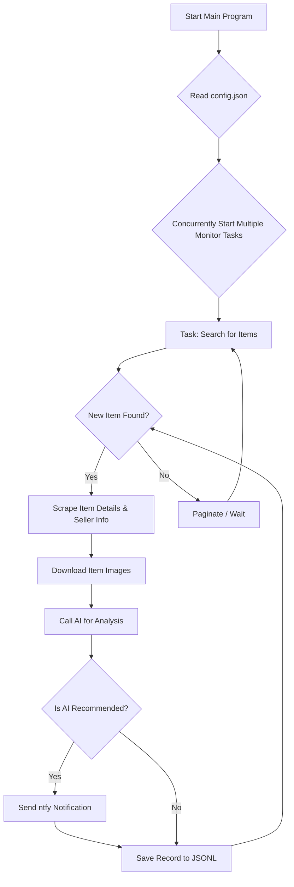

# AI-Powered Xianyu Monitor

A multi-task real-time monitoring and intelligent analysis tool for Xianyu (a major second-hand marketplace), based on Playwright and AI-powered filtering, complete with a full-featured web management interface.

## ✨ Project Highlights

- **Visual Web Interface**: Provides a complete Web UI for visual task management, online editing of AI criteria, real-time log viewing, and browsing/filtering of results, eliminating the need for direct command-line or config file operations.
- **AI-Driven Task Creation**: Simply describe your purchasing needs in natural language to create a new monitoring task with complex filtering logic in one click.
- **Concurrent Multi-Tasking**: Monitor multiple keywords simultaneously via `config.json`, with each task running independently without interference.
- **Real-time Stream Processing**: Immediately enters the analysis pipeline upon discovering a new item, saying goodbye to batch processing delays.
- **In-depth AI Analysis**: Integrates multi-modal large language models (like GPT-4o) for deep analysis combining item images, text, and seller profiles for precise filtering.
- **Highly Customizable**: Each monitoring task can be configured with independent keywords, price ranges, filtering conditions, and AI analysis instructions (Prompts).
- **Instant Notifications**: Immediately pushes AI-recommended items to your phone or desktop via [ntfy.sh](https://ntfy.sh/).
- **Robust Anti-Scraping Strategy**: Mimics human operation with various random delays and user behaviors to improve stability.

## 📸 Page Screenshots
Admin Panel - Task Management


Admin Panel - Monitoring Screenshot


Ntfy Notification Screenshot


## 🚀 Quick Start (Web UI Recommended)

Using the Web management interface is recommended for the best experience.

### Step 1: Environment Setup

Clone this project locally:
```bash
git clone https://github.com/dingyufei615/ai-goofish-monitor
cd ai-goofish-monitor
```

Install the required Python dependencies:
```bash
pip install -r requirements.txt
```

### Step 2: Basic Configuration

1.  **Configure Environment Variables**: Create a `.env` file in the project root directory and fill in the following configuration information.
    ```env
    # --- AI Model Related Configuration ---
    # API Key for the model.
    OPENAI_API_KEY="sk-..."
    
    # API endpoint address for the model. You need to fill in the OpenAI-compatible API address provided by your service provider. Almost all models provide OpenAI-compatible interfaces.
    # You can check the API documentation of the large model you are using. If the format is https://xx.xx.com/v1/chat/completions, then OPENAI_BASE_URL only needs the first part https://xx.xx.com/v1/
    OPENAI_BASE_URL="https://generativelanguage.googleapis.com/v1beta/openai/"
    
    # The name of the model to use, which must support image uploads.
    OPENAI_MODEL_NAME="gemini-1.5-pro"

    # (Optional) Configure an HTTP/S proxy for AI requests. Supports http and socks5. e.g., http://127.0.0.1:7890 or socks5://127.0.0.1:1080
    PROXY_URL=""

    # ntfy notification service configuration
    NTFY_TOPIC_URL="https://ntfy.sh/your-topic-name" # Replace with your ntfy topic URL
    
    # WeChat Work bot notification configuration. No need to configure if you don't have one.
    WX_BOT_URL="https://qyapi.weixin.qq.com/cgi-bin/webhook/send?key=xxxxx"

    # Whether to use Edge browser. Default is Chrome.
    LOGIN_IS_EDGE=false
    
    # Whether to convert PC links to mobile links.
    PCURL_TO_MOBILE=true
    
    # Whether the scraper runs in headless mode (true/false).
    # When running locally and encountering a slider captcha, you can set it to false to manually complete the verification. If you encounter risk control, it is recommended to stop running.
    # Docker deployment does not support a GUI, so set RUN_HEADLESS=true, otherwise it cannot run.
    RUN_HEADLESS=true

    # (Optional) AI debug mode (true/false). When enabled, it will print more logs to the console for troubleshooting AI analysis issues.
    AI_DEBUG_MODE=false

    # Custom server port. Defaults to 8000 if not configured.
    SERVER_PORT=8000
    ```

2.  **Get Login State (Important!)**: To allow the scraper to access Xianyu in a logged-in state, **you must run the login script once** to generate a session state file.
    ```bash
    python login.py
    ```
    A browser window will pop up after running. Please use the **Xianyu mobile app to scan the QR code** to complete the login. After success, the program will automatically close and generate a `xianyu_state.json` file in the project root directory.

### Step 3: Start the Web Service

Once everything is ready, start the web admin panel server.
```bash
python web_server.py
```

### Step 4: Start Using

Open `http://127.0.0.1:8000` in your browser to access the admin panel.

1.  On the **“Task Management”** page, click **“Create New Task”**.
2.  In the pop-up window, describe your purchase requirements in natural language (e.g., "I want to buy a Sony A7M4 camera that is over 95% new, with a budget under 13,000 yuan and a shutter count below 5000"), and fill in the task name, keywords, etc.
3.  Click create, and the AI will automatically generate a set of complex analysis criteria for you.
4.  Return to the main interface and click the **“🚀 Start All”** button in the upper right corner to enjoy automated monitoring!

## 🐳 Docker Deployment (Recommended)

Using Docker allows you to package the application and all its dependencies into a standardized unit for fast, reliable, and consistent deployment.

### Step 1: Environment Setup (Similar to local deployment)

1.  **Install Docker**: Make sure your system has [Docker Engine](https://docs.docker.com/engine/install/) installed.

2.  **Clone and Configure the Project**:
    ```bash
    git clone https://github.com/dingyufei615/ai-goofish-monitor
    cd ai-goofish-monitor
    ```

3.  **Create `.env` File**: Follow the instructions in the **[Quick Start](#-quick-start-web-ui-recommended)** section to create and fill in the `.env` file in the project root directory.

4.  **Get Login State (Crucial Step!)**: Run the login script **on the host machine (not inside Docker)** to generate the `xianyu_state.json` file. This is because the login process requires manual interaction (QR code scanning) and cannot be completed during the Docker build process.
    ```bash
    # Make sure you have a local python environment with dependencies installed
    pip install -r requirements.txt
    python login.py 
    ```
    After successful QR code login, the `xianyu_state.json` file will be generated in the project root directory.

### Step 2: Run the Docker Container

The project includes a `docker-compose.yaml` file. We recommend using `docker-compose` to manage the container, which is more convenient than using `docker run`.

In the project root directory, run the following command to start the container:
```bash
docker-compose up -d
```
This will start the service in detached mode. `docker-compose` will automatically read the `.env` file and the `docker-compose.yaml` configuration to create and start the containers.

If you encounter network issues within the container, please troubleshoot or use a proxy yourself.

### Step 3: Access and Manage

- **Access Web UI**: Open `http://127.0.0.1:8000` in your browser.
- **View Real-time Logs**: `docker-compose logs -f`
- **Stop the Container**: `docker-compose stop`
- **Start a Stopped Container**: `docker-compose start`
- **Stop and Remove the Container**: `docker-compose down`

## 📸 Web UI Features Overview

-   **Task Management**:
    -   **AI Task Creation**: Use natural language to describe your needs, creating a monitoring task and its corresponding AI analysis criteria with one click.
    -   **Visual Editing**: Directly modify task parameters like keywords, price range, etc., in a table.
    -   **Start/Stop Control**: Independently control the enabled/disabled state of each task, or start/stop all tasks with one click.
-   **Result Viewer**:
    -   **Card-based Browsing**: Clearly display each qualifying item as a card with an image and text.
    -   **Smart Filtering**: One-click filtering to show all items marked as "Recommended" by the AI.
    -   **In-depth Details**: View the complete scraped data for each item and the detailed JSON results of the AI analysis.
-   **Run Logs**:
    -   **Real-time Log Stream**: View detailed logs of the scraper's operation in real-time on the web page, making it easy to track progress and troubleshoot issues.
-   **System Settings**:
    -   **Status Check**: One-click check to see if key dependencies like `.env` configuration and login status are normal.
    -   **Online Prompt Editing**: Directly edit and save the `prompt` files used for AI analysis on the web page, adjusting the AI's thinking logic in real-time.

## ⚙️ Advanced Command-Line Usage

For users who prefer the command line, the project also retains the ability to run scripts independently.

### Start Monitoring

Directly run the main scraper script, which will load all enabled tasks from `config.json`.
```bash
python spider_v2.py
```
**Debug Mode**: If you only want to test a small number of items, you can use the `--debug-limit` parameter.
```bash
# Each task only processes the first 2 newly found items
python spider_v2.py --debug-limit 2
```

### Create a New Task via Script

The `prompt_generator.py` script allows you to quickly create new tasks via the command line.
```bash
python prompt_generator.py \
  --description "I want to buy a Sony A7M4 camera, 95% new or better, budget between 10,000 and 13,000 yuan, shutter count below 5000. Must be a domestic version with full accessories. Prefer personal sellers, no merchants or dealers." \
  --output prompts/sony_a7m4_criteria.txt \
  --task-name "Sony A7M4" \
  --keyword "a7m4" \
  --min-price "10000" \
  --max-price "13000"
```
After execution, it will automatically create a new `_criteria.txt` file and add and enable the corresponding new task in `config.json`.

## 🚀 Workflow



## 🛠️ Tech Stack

- **Core Framework**: Playwright (async) + asyncio
- **Web Service**: FastAPI
- **AI Model**: OpenAI API (supports multi-modal models like GPT-4o)
- **Notification Service**: ntfy
- **Configuration Management**: JSON
- **Dependency Management**: pip

## 📂 Project Structure

```
.
├── .env                # Environment variables, for storing API keys and other sensitive info
├── .gitignore          # Git ignore configuration
├── config.json         # Core configuration file for defining all monitoring tasks
├── login.py            # Must be run first time to get and save login cookies
├── spider_v2.py        # Core scraper program
├── prompt_generator.py # AI analysis criteria generation script
├── web_server.py       # Main web service program
├── requirements.txt    # Python dependency libraries
├── README.md           # The file you are currently reading
├── prompts/            # Stores AI analysis instructions (Prompts) for different tasks
│   ├── base_prompt.txt
│   └── ..._criteria.txt
├── static/             # Web frontend static files
│   ├── css/style.css
│   └── js/main.js
├── templates/          # Web frontend templates
│   └── index.html
├── images/             # (Auto-created) Stores downloaded item images
├── logs/               # (Auto-created) Stores run logs
└── jsonl/              # (Auto-created) Stores scrape and analysis results for each task
```

## Frequently Asked Questions (FAQ)

Here are some common questions from community users in the Issues and their answers.

1.  **Q: I get a `'gbk' codec can't encode character` related encoding error when running `login.py` or `spider_v2.py`?**
    *   **A:** This is a typical encoding issue in a Windows environment. The project code and logs use UTF-8 encoding by default.
    *   **Solution:** Force the use of UTF-8 by setting an environment variable before running the Python script. Execute the following command in PowerShell or CMD, and then run the script:
        ```bash
        set PYTHONUTF8=1
        python spider_v2.py
        ```
        Alternatively, use the `chcp 65001` command to switch the active code page to UTF-8.

2.  **Q: When running `login.py`, it prompts that `playwright install` is needed. What should I do?**
    *   **A:** This error indicates that the browser files required by Playwright are missing. The recommended solution is to ensure all dependencies are correctly installed via `requirements.txt`. Please run in the command line:
        ```bash
        pip install -r requirements.txt
        ```
        If the problem persists, you can try to manually install the chromium browser:
        ```bash
        playwright install chromium
        ```

3.  **Q: When creating a task or running the script, I get a "Request timed out" or "Connection error". What is the reason?**
    *   **A:** This is usually a network issue, meaning your server cannot connect to the `OPENAI_BASE_URL` configured in the `.env` file. Please check:
        *   If your server's network is clear.
        *   If you are in mainland China, accessing foreign AI services (like OpenAI, Gemini) may require setting up a network proxy. You can now solve this by configuring the `PROXY_URL` variable directly in the `.env` file.
        *   Confirm that the `OPENAI_BASE_URL` address is correct and that the service is running normally.

4.  **Q: What if the AI model I chose does not support image analysis?**
    *   **A:** One of the core advantages of this project is multi-modal analysis combining images, so you **must** choose an AI model that supports image recognition (Vision / Multi-modal). If the model you configure does not support images, the AI analysis will fail or its effectiveness will be greatly reduced. Please change the `OPENAI_MODEL_NAME` in the `.env` file to a model that supports image input, such as `gpt-4o`, `gemini-1.5-pro`, `deepseek-v2`, `qwen-vl-plus`, etc.

5.  **Q: Can I deploy this on a Synology NAS via Docker?**
    *   **A:** Yes. The deployment steps are basically the same as a standard Docker deployment:
        1.  Complete the `login.py` step on your computer (not on the Synology) to generate the `xianyu_state.json` file.
        2.  Upload the entire project folder (including `.env` and `xianyu_state.json`) to a directory on your Synology.
        3.  In Synology's Container Manager (or the older Docker package), use the `docker-compose up -d` command (via SSH or a scheduled task) to start the project. Make sure the volume mapping path in `docker-compose.yaml` correctly points to your project folder on the Synology.

6.  **Q: How do I configure it to use Gemini / Qwen / Grok or other non-OpenAI large language models?**
    *   **A:** This project theoretically supports any model that provides an OpenAI-compatible API interface. The key is to correctly configure three variables in the `.env` file:
        *   `OPENAI_API_KEY`: The API Key provided by your model service provider.
        *   `OPENAI_BASE_URL`: The API-Compatible Endpoint address provided by the model service provider. Be sure to consult the official documentation of the model you are using. The format is usually `https://api.your-provider.com/v1` (note, it does not need `/chat/completions` at the end).
        *   `OPENAI_MODEL_NAME`: The specific model name you want to use, which needs to support image recognition, for example `gemini-1.5-flash`.
    *   **Example:** If your service provider's documentation says the Completions endpoint is `https://xx.xx.com/v1/chat/completions`, then `OPENAI_BASE_URL` should be `https://xx.xx.com/v1`.

7.  **Q: After running for a while, I'm detected by Xianyu and get an "abnormal traffic" prompt or need to solve a slider captcha?**
    *   **A:** This is Xianyu's anti-scraping mechanism. To reduce the risk of detection, you can try the following methods:
        *   **Disable headless mode:** Set `RUN_HEADLESS=false` in the `.env` file. This will run the browser with a GUI, and when a slider captcha appears, you can manually complete the verification, and the program will continue.
        *   **Reduce monitoring frequency:** Avoid running a large number of monitoring tasks at the same time.
        *   **Use a clean network environment:** Frequent scraping may cause your IP to be temporarily flagged.


## Acknowledgements

During the development of this project, reference was made to the following excellent projects, and special thanks are given:
- [superboyyy/xianyu_spider](https://github.com/superboyyy/xianyu_spider)

And thanks to the script contributions from relevant members of the LinuxDo community
- [@jooooody](https://linux.do/u/jooooody/summary)

And thanks to Aider and Gemini for liberating my hands, making coding feel like flying~

## ⚠️ Disclaimer

- Please abide by Xianyu's user agreement and robots.txt rules. Do not make overly frequent requests to avoid burdening the server or having your account restricted.
- This project is for learning and technical research purposes only. Do not use it for any illegal activities.

[](https://star-history.com/#dingyufei615/ai-goofish-monitor&Date)
