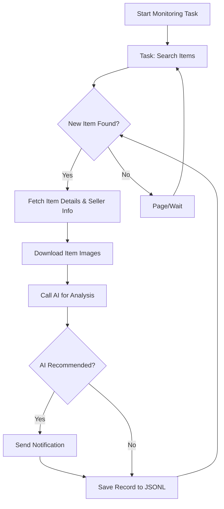

# Xianyu (Goofish) AI Monitoring Bot

A Playwright and AI-powered real-time monitoring and intelligent analysis tool for Xianyu (Goofish), featuring a comprehensive web management interface.

## ✨ Key Features

- **Web UI**: Complete web interface for visual task management, online AI criteria editing, real-time log viewing, and result browsing without command-line or configuration file operations.
- **AI-Driven Task Creation**: Simply describe your purchase requirements in natural language to create complex monitoring tasks with advanced filtering logic in one click.
- **Concurrent Multi-Tasking**: Monitor multiple keywords simultaneously through `config.json`, with each task running independently without interference.
- **Real-Time Streaming Processing**: Immediately analyze new items as they are discovered, eliminating batch processing delays.
- **Deep AI Analysis**: Integrated with multimodal large language models (such as GPT-4o) for deep analysis combining product images, text, and seller profiles for precise filtering.
- **Highly Customizable**: Each monitoring task can be configured with independent keywords, price ranges, filtering criteria, and AI analysis prompts.
- **Instant Notifications**: Send qualified items immediately to your phone or desktop via [ntfy.sh](https://ntfy.sh/), enterprise WeChat group bots, and [Bark](https://bark.day.app/).
- **Scheduled Task Scheduling**: Support Cron expressions to set independent execution schedules for each task.
- **Docker One-Click Deployment**: Provides `docker-compose` configuration for fast, standardized containerized deployment.
- **Robust Anti-Crawling Strategy**: Simulates human behavior with various random delays and user actions to improve stability.

## Screenshots

**Backend Task Management**


**Backend Monitoring Screenshot**


**Notification Screenshot**


## 🚀 Quick Start (Web UI Recommended)

We recommend using the Web management interface for the best experience.

### Step 1: Environment Preparation

> ⚠️ **Python Version Requirements**: Python 3.10 or higher is recommended for local deployment and debugging. Lower versions may cause dependency installation failures or runtime errors (such as `ModuleNotFoundError: No module named 'PIL'`).

Clone the project locally:

```bash
git clone https://github.com/dingyufei615/ai-goofish-monitor
cd ai-goofish-monitor
```

Install the required Python dependencies:

```bash
pip install -r requirements.txt
```

### Step 2: Basic Configuration

1. **Configure Environment Variables**: Copy the `.env.example` file and rename it to `.env`, then modify its contents.

    Windows command line:

    ```cmd
    copy .env.example .env
    ```

    Linux/MacOS command line:

    ```shell
    cp .env.example .env
    ```

    All available configuration items in the `.env` file are as follows:

    | Environment Variable | Description | Required | Notes |
    | :--- | :--- | :--- | :--- |
    | `OPENAI_API_KEY` | API Key provided by your AI model service provider. | Yes | This may be optional for certain local or specific proxy services. |
    | `OPENAI_BASE_URL` | API interface address of the AI model, must be compatible with OpenAI format. | Yes | Please fill in the base path of the API, for example `https://ark.cn-beijing.volces.com/api/v3/`. |
    | `OPENAI_MODEL_NAME` | The specific model name you want to use. | Yes | **Must** select a multimodal model that supports image analysis, such as `doubao-seed-1-6-250615`, `gemini-2.5-pro`, etc. |
    | `PROXY_URL` | (Optional) HTTP/S proxy configuration for accessing sites that require a VPN. | No | Supports `http://` and `socks5://` formats. For example `http://127.0.0.1:7890`. |
    | `NTFY_TOPIC_URL` | (Optional) [ntfy.sh](https://ntfy.sh/) topic URL for sending notifications. | No | If left blank, ntfy notifications will not be sent. |
    | `GOTIFY_URL` | (Optional) Gotify service address. | No | For example `https://push.example.de`. |
    | `GOTIFY_TOKEN` | (Optional) Gotify application Token. | No | |
    | `BARK_URL` | (Optional) [Bark](https://bark.day.app/) push address. | No | For example `https://api.day.app/your_key`. If left blank, Bark notifications will not be sent. |
    | `WX_BOT_URL` | (Optional) Enterprise WeChat group robot Webhook address. | No | If left blank, enterprise WeChat notifications will not be sent. |
    | `WEBHOOK_URL` | (Optional) Generic Webhook URL address. | No | If left blank, generic Webhook notifications will not be sent. |
    | `WEBHOOK_METHOD` | (Optional) Webhook request method. | No | Supports `GET` or `POST`, defaults to `POST`. |
    | `WEBHOOK_HEADERS` | (Optional) Custom request headers for Webhook. | No | Must be a valid JSON string, for example `'{"Authorization": "Bearer xxx"}'`. |
    | `WEBHOOK_CONTENT_TYPE` | (Optional) Content type for POST requests. | No | Supports `JSON` or `FORM`, defaults to `JSON`. |
    | `WEBHOOK_QUERY_PARAMETERS` | (Optional) Query parameters for GET requests. | No | JSON string, supports `{{title}}` and `{{content}}` placeholders. |
    | `WEBHOOK_BODY` | (Optional) Request body for POST requests. | No | JSON string, supports `{{title}}` and `{{content}}` placeholders. |
    | `LOGIN_IS_EDGE` | Whether to use Edge browser for login and crawling. | No | Defaults to `false`, uses Chrome/Chromium. |
    | `PCURL_TO_MOBILE` | Whether to convert desktop product links to mobile version in notifications. | No | Defaults to `true`. |
    | `RUN_HEADLESS` | Whether to run the crawler browser in headless mode. | No | Defaults to `true`. Set to `false` for manual handling when debugging locally with CAPTCHA. **Must be `true` for Docker deployment**. |
    | `AI_DEBUG_MODE` | Whether to enable AI debug mode. | No | Defaults to `false`. When enabled, detailed AI request and response logs will be printed to the console. |
    | `SKIP_AI_ANALYSIS` | Whether to skip AI analysis and send notifications directly. | No | Defaults to `false`. When set to `true`, all crawled items will be sent as notifications without AI analysis. |
    | `ENABLE_THINKING` | Whether to enable the enable_thinking parameter. | No | Defaults to `false`. Some AI models require this parameter, while others do not support it. If you encounter "Invalid JSON payload received. Unknown name "enable_thinking"" error, try setting it to `false`. |
    | `SERVER_PORT` | Web UI service running port. | No | Defaults to `8000`. |
    | `WEB_USERNAME` | Web interface login username. | No | Defaults to `admin`. Please change in production environment. |
    | `WEB_PASSWORD` | Web interface login password. | No | Defaults to `admin123`. Please change to a strong password in production environment. |

    > 💡 **Debugging Tips**: If you encounter 404 errors when configuring AI API, it is recommended to debug with Alibaba Cloud or Volcano Engine API first to ensure basic functionality before trying other API providers. Some API providers may have compatibility issues or require special configurations.

    > 🔐 **Security Reminder**: The Web interface is protected by Basic authentication. The default username and password are `admin` / `admin123`, please change to a strong password in production environment!

2. **Get Login Status (Important!)**: To allow the crawler to access Xianyu in a logged-in state, valid login credentials must be provided. We recommend using the Web UI to complete this operation:

    **Recommended Method: Update via Web UI**
    1. Skip this step for now and proceed to Step 3 to start the Web service.
    2. Open the Web UI and go to the **"System Settings"** page.
    3. Find "Login Status File" and click the **"Manual Update"** button.
    4. Follow the detailed instructions in the popup:
       - On your personal computer, use Chrome browser to install the [Xianyu Login State Extraction Extension](https://chromewebstore.google.com/detail/xianyu-login-state-extrac/eidlpfjiodpigmfcahkmlenhppfklcoa)
       - Open and log in to the Xianyu website
       - After successful login, click the extension icon in the browser toolbar
       - Click the "Extract Login Status" button to get login information
       - Click the "Copy to Clipboard" button
       - Paste the copied content into the Web UI and save

    This method does not require running a program with a graphical interface on the server, making it the most convenient.

    **Alternative Method: Run Login Script**
    If you can run programs locally or on a server with a desktop, you can also use the traditional script method:

    ```bash
    python login.py
    ```

    After running, a browser window will pop up. Please use the **mobile Xianyu app to scan the QR code** to complete the login. After success, the program will automatically close and generate a `xianyu_state.json` file in the project root directory.

### Step 3: Start Web Service

After everything is ready, start the Web management backend server.

```bash
python web_server.py
```

### Step 4: Start Using

Open `http://127.0.0.1:8000` in your browser to access the management backend.

1. On the **"Task Management"** page, click **"Create New Task"**.
2. In the popup window, describe your purchase requirements in natural language (for example: "I want to buy a Sony A7M4 camera with 95% new or above, budget within 13,000 RMB, shutter count below 5000"), and fill in the task name, keywords, and other information.
3. Click create, and AI will automatically generate a set of complex analysis criteria for you.
4. Return to the main interface, add a schedule to the task or click start directly to begin automated monitoring!

## 🐳 Docker Deployment (Recommended)

Using Docker can package the application and all its dependencies into a standardized unit for fast, reliable, and consistent deployment.

### Step 1: Environment Preparation (Similar to Local Deployment)

1. **Install Docker**: Ensure [Docker Engine](https://docs.docker.com/engine/install/) is installed on your system.

2. **Clone Project and Configure**:

    ```bash
    git clone https://github.com/dingyufei615/ai-goofish-monitor
    cd ai-goofish-monitor
    ```

3. **Create `.env` File**: Refer to the **[Quick Start](#-quick-start-web-ui-recommended)** section to create and fill in the `.env` file in the project root directory.

4. **Get Login Status (Critical Step!)**: Login cannot be performed within the Docker container. Please set the login status by accessing the Web UI after **starting the container**:
    1. (On the host machine) Execute `docker-compose up -d` to start the service.
    2. Open `http://127.0.0.1:8000` in your browser to access the Web UI.
    3. Go to the **"System Settings"** page and click the **"Manual Update"** button.
    4. Follow the instructions in the popup:
       - On your personal computer, use Chrome browser to install the [Xianyu Login State Extraction Extension](https://chromewebstore.google.com/detail/xianyu-login-state-extrac/eidlpfjiodpigmfcahkmlenhppfklcoa)
       - Open and log in to the Xianyu website
       - After successful login, click the extension icon in the browser toolbar
       - Click the "Extract Login Status" button to get login information
       - Click the "Copy to Clipboard" button
       - Paste the copied content into the Web UI and save

> ℹ️ **About Python Version**: When using Docker deployment, the project uses Python 3.11 version specified in the Dockerfile, so there's no need to worry about local Python version compatibility issues.

### Step 2: Run Docker Container

The project includes a `docker-compose.yaml` file. We recommend using `docker-compose` to manage containers, which is more convenient than using `docker run`.

In the project root directory, run the following command to start the container:

```bash
docker-compose up --build -d
```

This will start the service in background mode. `docker-compose` will automatically read the configuration from `.env` file and `docker-compose.yaml`, and create and start containers based on their contents.

If network issues occur within the container, please troubleshoot or use a proxy on your own.

> ⚠️ **OpenWrt Environment Deployment Notes**: If you deploy this application on an OpenWrt router, you may encounter DNS resolution issues. This is because the default network created by Docker Compose may not correctly inherit OpenWrt's DNS settings. If you encounter `ERR_CONNECTION_REFUSED` errors, please check your container network configuration. You may need to manually configure DNS or adjust the network mode to ensure the container can access external networks properly.

### Step 3: Access and Management

- **Access Web UI**: Open `http://127.0.0.1:8000` in your browser.
- **View Real-Time Logs**: `docker-compose logs -f`
- **Stop Container**: `docker-compose stop`
- **Start Stopped Container**: `docker-compose start`
- **Stop and Remove Container**: `docker-compose down`

## 📸 Web UI Features Overview

- **Task Management**:
  - **AI Task Creation**: Use natural language to describe requirements and generate monitoring tasks and accompanying AI analysis criteria with one click.
  - **Visual Editing and Control**: Directly modify task parameters (such as keywords, prices, scheduling rules, etc.) in the table, and independently start/stop/delete each task.
  - **Scheduled Scheduling**: Configure Cron expressions for tasks to achieve automated periodic execution.
- **Result Viewing**:
  - **Card View**: Clearly display each qualified item in an image-text card format.
  - **Smart Filtering and Sorting**: Filter all AI-marked "recommended" items with one click, and support sorting by crawl time, publication time, price, and other methods.
  - **Detailed Information**: Click to view complete crawl data and detailed JSON results of AI analysis for each item.
- **Runtime Logs**:
  - **Real-Time Log Stream**: View detailed crawler runtime logs in real-time on the web page for easy progress tracking and troubleshooting.
  - **Log Management**: Support automatic refresh, manual refresh, and one-click log clearing.
- **System Settings**:
  - **Status Check**: One-click check if key dependencies such as `.env` configuration and login status are normal.
  - **Prompt Online Editing**: Directly edit and save the `prompt` files used for AI analysis on the web page to adjust AI thinking logic in real-time.

## 🚀 Workflow

The diagram below describes the core processing logic of a single monitoring task from startup to completion. In actual use, `web_server.py` will serve as the main service, starting one or more such task processes based on user operations or scheduled scheduling.



## 🔐 Web Interface Authentication

### Authentication Configuration

The Web interface is protected by Basic authentication to ensure that only authorized users can access the management interface and API.

#### Configuration Method

Set authentication credentials in the `.env` file:

```bash
# Web Service Authentication Configuration
WEB_USERNAME=admin
WEB_PASSWORD=admin123
```

#### Default Credentials

If authentication credentials are not set in the `.env` file, the system will use the following default values:
- Username: `admin`
- Password: `admin123`

**⚠️ Important: Please change the default password in production environment!**

#### Authentication Scope

- **Requires Authentication**: All API endpoints, Web interface, static resources
- **No Authentication Required**: Health check endpoint (`/health`)

#### Usage

1. **Browser Access**: An authentication dialog will pop up when accessing the Web interface
2. **API Calls**: Need to include Basic authentication information in the request header
3. **Frontend JavaScript**: Automatically handles authentication without modification

#### Security Recommendations

1. Change default password to a strong password
2. Use HTTPS protocol in production environment
3. Regularly change authentication credentials
4. Restrict access IP range through firewall

For detailed configuration instructions, please refer to [AUTH_README.md](AUTH_README.md).

## Frequently Asked Questions (FAQ)

We have compiled a detailed FAQ document covering various issues from environment configuration, AI setup to anti-crawling strategies.

👉 **[Click here to view the FAQ (FAQ.md)](FAQ.md)**

## Acknowledgements

This project referenced the following excellent projects during development, special thanks:

- [superboyyy/xianyu_spider](https://github.com/superboyyy/xianyu_spider)

And thanks to LinuxDo contributors for their scripts

- [@jooooody](https://linux.do/u/jooooody/summary)

And thanks to the [LinuxDo](https://linux.do/) community.

And thanks to ClaudeCode/ModelScope/Gemini and other models/tools for enabling hands-free development and experiencing the joy of Vibe Coding.

## Experience

90%+ of the code in this project is generated by AI, including PRs related to issues.

The scary thing about Vibe Coding is that if you don't participate too much in project construction, don't carefully review AI-generated code, and don't think about why AI wrote it that way, blindly passing test cases to verify functionality will only turn the project into a black box.

Similarly, when using AI to code review AI-generated code, it's like using AI to verify another AI's answer, falling into a self-proving dilemma. Therefore, AI can assist in analysis but should not be the arbiter of truth.

AI is omnipotent and can help developers solve 99% of coding problems. AI is also not omnipotent - every problem solved needs to be verified and thought through by the developer. AI is an assistant, and AI-generated content can only be auxiliary.

## ⚠️ Notes

- Please comply with Xianyu's user agreement and robots.txt rules, do not make overly frequent requests to avoid burdening the server or having your account restricted.
- This project is for learning and technical research purposes only, please do not use it for illegal purposes.
- This project is released under the [MIT License](LICENSE) "as is" without any form of warranty.
- The project authors and contributors are not liable for any direct, indirect, incidental, or special damages or losses caused by using this software.
- For more detailed information, please see the [Disclaimer](DISCLAIMER.md) file.

[](https://star-history.com/#dingyufei615/ai-goofish-monitor&Date)